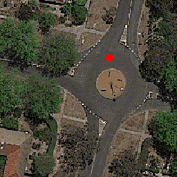
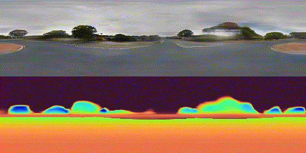
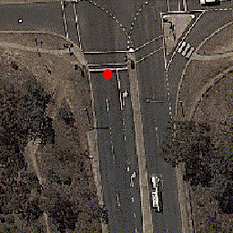
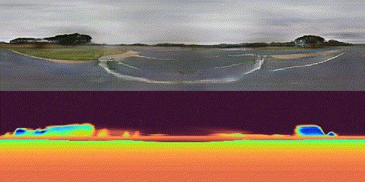
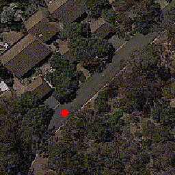
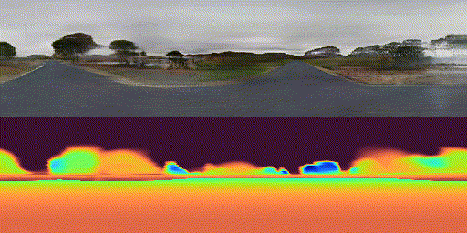
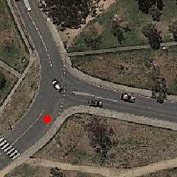
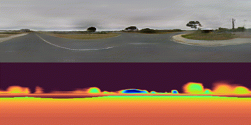

# Sat2Density: Faithful Density Learning from Satellite-Ground Image Pairs

> [Ming Qian](https://qianmingduowan.github.io/), Jincheng Xiong, [Gui-Song Xia](http://www.captain-whu.com/xia_En.html), [Nan Xue](https://xuenan.net)
>
> IEEE/CVF International Conference on Computer Vision (ICCV), 2023
>
> [Project](https://sat2density.github.io/) | [Paper](https://arxiv.org/abs/2303.14672) | [Data]() | [Install.md](docs/INSTALL.md)

> <p align="center">
>    
>    
> </p>
> <p align="center">
>    
>    
> </p>
> <p align="center">
>    
>    
> </p>
> <p align="center">
>    
>    
> </p>

## Checkpoints Downloading
> Two checkpoints for CVACT and CVUSA can be found from [thisurl](https://github.com/sat2density/checkpoints/releases). You can also run the following command to download them.
```
bash scripts/download_weights.sh
```

## QuickStart Demo
### Video Synthesis
  #### Example Usage
  ```
  python test.py --yaml=sat2density_cvact \
    --test_ckpt_path=2u87bj8w \
    --task=test_vid \
    --demo_img=demo_img/case1/satview-input.png  \
    --sty_img=demo_img/case1/groundview.image.png  \
    --save_dir=results/case1
  ```
  #### 

### Illumination Interpolation
```
bash inference/quick_demo_interpolation.sh
```


## Train & Inference
- *We trained our model using 1 V100 32GB GPU. The training phase will take about 20 hours.*
- *For data preparation, please check out [data.md](dataset/INSTALL.md).*


### Inference

To test Center Ground-View Synthesis setting
If you want save results, please add --task=vis_test
```bash
# CVACT
python offline_train_test.py --yaml=sat2density_cvact --test_ckpt_path=2u87bj8w
# CVUSA
python offline_train_test.py --yaml=sat2density_cvusa --test_ckpt_path=2cqv8uh4
```

To test inference with different illumination
```bash
# CVACT
bash inference/single_style_test_cvact.sh
# CVUSA
bash inference/single_style_test_cvusa.sh
```

To test synthesis ground videos
```bash
bash inference/synthesis_video.sh
```

## Training

### Training command

```bash
# CVACT
CUDA_VISIBLE_DEVICES=X python train.py --yaml=sat2density_cvact
# CVUSA
CUDA_VISIBLE_DEVICES=X python train.py --yaml=sat2density_cvusa
```

## Citation
If you use this code for your research, please cite

```
@inproceedings{qian2021sat2density,
  title={Sat2Density: Faithful Density Learning from Satellite-Ground Image Pairs},
  author={Qian, Ming and Xiong, Jincheng and Xia, Gui-Song and Xue, Nan},
  booktitle={ICCV},
  year={2023}
}
```

## License
This work is licensed under a Creative Commons Attribution-NonCommercial 4.0 International License.
For commercial use, please contact [mingqian@whu.edu.cn].
